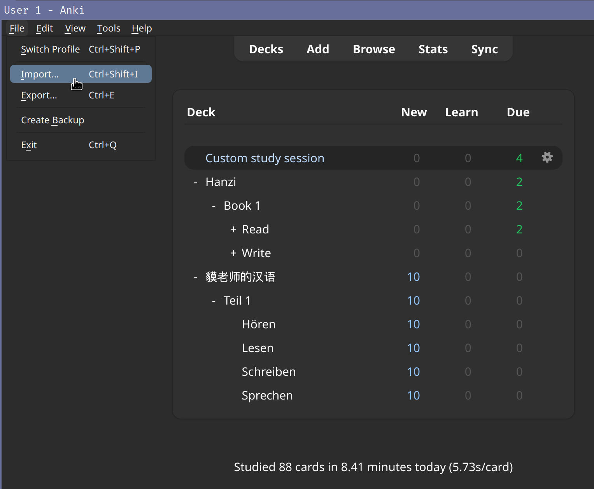
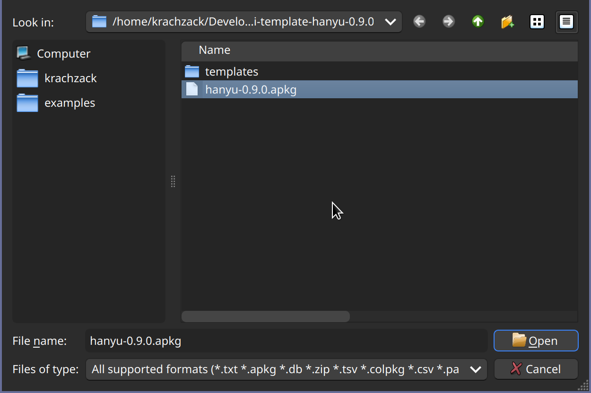
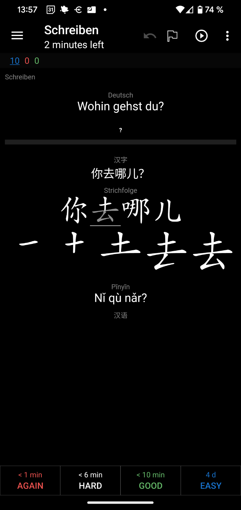

# 貘老师的汉语
_English version below_

Hier gibt es Karteikarten für das Lernprogramm _Anki_. Ich verwende sie um
Mandarin-chinesisch zu lernen. Übersetzungen für chinesische Begriffe sind auf
_deutsch_.

Es gibt folgende Arten von Karten:
* Gesprochenes Chinesisch verstehen,
* Hànzì und Pīnyīn lesen,
* Hànzì schreiben,
* deutsche Begriffe auf chinesisch übersetzen.

Die Karteikarten können wie sie sind verwendet werden, oder individuell
angepasst werden. Zum Beispiel können in Anki neue Vokabeln hinzugefügt werden,
oder die existierenden Vokabeln können für eine andere Sprache als Deutsch
angepasst werden. Programmierkenntnisse sind dazu nicht nötig.

Wenn du gerne programmierst, kannst du dieses Repository herunterladen und für
deine Zwecke anpassen. Mehr Details dazu gibt es weiter unten.

## Installation
Um einfach nur zu üben, befolge die folgenden Schritte.

### Schritt 1: apkg herunterladen
Lade die neueste _apkg_-Datei vom GitHub-Repository unter
[Releases](https://github.com/tapirbug/anki-template-hanyu/releases) auf einen
PC herunter, z.B. `hanyu-0.9.0.apkg`.

### Schritt 2: Anki Desktop intallieren
Wenn du Anki noch nicht auf deinem PC installiert hast, lade es von der
offiziellen [Anki](https://apps.ankiweb.net/#download)-Seite herunter und
installiere.

### Schritt 3: apkg importieren
Importiere das _apkg_-Deck in Anki Desktop, z.B. unter _File | Import…_:

Damit ist alles erledigt um am PC zu lernen. Probiere es aus!

### Schritt 4: Anki am Smartphone (optional)
Schön an Anki ist, dass man auch am Smartphone oder anderen Geräten lernen
kann. Du kannst diesen Schritt überspringen falls du das (noch) nicht brauchst,
oder du kannst es später erledigen.

Stelle zuerst sicher, dass deine Kartensammlung mit Anki Web synchron ist.
Betätige dazu den _Sync_-Knopf open rechts. Du musst dich registrieren, falls
noch nicht geschehen.

Wenn die Synchronisierung abgeschlossen ist, kannst du über einen Web-Browser
auf deinem Smartphone unter https://ankiweb.net/ lernen. Wenn du eine App
bevorzugst, probiere
[AnkiDroid](https://play.google.com/store/apps/details?id=com.ichi2.anki&hl=de_AT&gl=US&pli=1)
(for Android-Handys, gratis)
oder
[Anki Mobile](https://apps.apple.com/de/app/ankimobile-flashcards/id373493387)
(mobile Apple-Geräte, z.B. iPhone or iPad, ~30€).

### Schritt 5: Vorlese-Funktion in AnkiDroid konfigurieren (optional)
Bei Benutzung von AnkiDroid wird empfohlen Text-to-speech unter
_Settings | Advanced | Text to speech_ zu aktivieren. Wie bei der Desktop-App
werden dann bei den Zuhör-Übungen chinesische Begriffe laut abgespielt. Für
andere Karten-Typen erfolgt die Sprachausgabe auf der Rückseite der
Karteikarte. Um erneut abzuspielen, gibt es in _AnkiDroid_ einen Play-Button in
der Menüleiste oben. Der Button ist möglicherweise ausgeblendet. Er lässt sich
unter _Settings | Reviewing | App bar buttons | Replay audio_ einblenden, indem
man die Einstellung auf _Always show_ setzt.

Auf anderen Plattformen wie _AnkiWeb_, _Anki Mobile_ oder auf der PC-Version
von Anki ist keine Konfiguration erforderlich. Hier kann der Play-Button auf
der Karte verwendet werden.

### Step 5: Genießen!
Das war's, viel Spaß beim lernen!

## Fortgeschrittene Anwendung
### Wie kann ich mir die Strichfolge für ein chinesisches Zeichen ansehen?
Wenn du ein animiertes chinesisches Zeichen siehst, kannst du darauf klicken
bzw. es berühren. Es öffnet sich eine Tabelle mit den einzelnen Strichen, z.B.:

### Auf eine neuere Version updaten
Wenn eine neuere Version als apkg verfügbar ist und du updaten möchtest, folge
noch einmal den Schritten oben. Neue Vokabeln und Features werden importiert,
aber dein bisheriger Fortschritt bleibt.

### Wenn ich ein Smartphone verwende, brauche ich dann trotzdem die PC-Version?
Ja, mit der PC-Version kann das _apkg_ importiert bzw. upgedated werden. Sobald
du deine Kartensammlung mit Anki Web synchronisiert hast, kannst du auch auf
_AnkiDroid_, _Anki Mobile_ oder _Anki Web_ von einem Smartphone aus lernen.

## Anpassung
Siehe dazu die englische Version unter _Advanced usage and customization_.

## Zum Kartendeck beitragen
Du kannst gern ein GitHub-Issue anlegen wenn du Schwierigkeiten bei der
Verwendung hast. Ein Pull-Request freut mich natürlich noch mehr. Für
Verbesserungsvorschläge auch gerne Issues anlegen.

Wenn du selbst kein sehr technischer Benutzer bist aber trotzdem neue Wörter
hinzufügen willst, kannst du auch gerne ein Issue mit deinen Wörtern anlegen
und ich helfe dabei.

# 貘老师的汉语 (English version)
This is a flashcard deck for the popular _Anki_ app to learn Mandarin Chinese.
It is targeted at native speakers of _German_ and includes cards to practice:
* listening to and understanding Chinese speech,
* reading Hànzì and Pīnyīn,
* writing Hànzì,
* translating German words and expressions to Chinese.

You can use this deck as-is or customize it to your needs. For example, you
can add new words within Anki, or you can change the translations of existing
words to some other language if you don't speak German. You don't need any
coding skills to do any of this.

If you like coding, you can also check out this repository and customize the
template for your own needs. See below for details.

## Quickstart guide
If you just want to practice, follow these steps.

### Step 1: Download apkg
Download the latest deck as an _apkg_ file from the
[Releases](https://github.com/tapirbug/anki-template-hanyu/releases)
section on the GitHub repo, e.g. download `hanyu-0.9.0.apkg` and save it on
your PC.

### Step 2: Install Anki Desktop
If you don't yet have Anki installed, download a version for your PC from the
official [Anki](https://apps.ankiweb.net/#download) website. Install it to
your PC.

### Step 3: Import the Deck
Import the _apkg_ deck into Anki with _File | Import…_ on Anki Desktop:

That's all you need to practice on your PC. Go ahead and try it out!

### Step 4: Set up Anki on your phone (optional)
A nice feature of Anki is that you can also practice on your phone or other
device. If you don't need this right now, skip this step completely or do it
later.

First, make sure that your collection of cards is synced to the web. Hit the
_Sync_ button on the top right in Anki Desktop to do this. You may need to
register if you don't yet have an account on Anki Web.

When the synchronization has finished, you can practice over the web on any
device including your mobile phone by visiting https://ankiweb.net/ in your
browser. If you prefer a native app, try
[AnkiDroid](https://play.google.com/store/apps/details?id=com.ichi2.anki&hl=de_AT&gl=US&pli=1)
(for Android phones, free)
or
[Anki Mobile](https://apps.apple.com/de/app/ankimobile-flashcards/id373493387)
(mobile Apple devices, e.g. iPhone or iPad, ~30€).

### Step 5: Configuring text-to-speech on AnkiDroid (optional)
When using AnkiDroid, it is recommended to activate text-to-speech under
_Settings | Advanced | Text to speech_. This will speak the characters out loud
when practicing listening (or for other cards when the backside is shown). To
replay the sound, use the play button in the menu bar. This button may be
invisible for you unless you change it to _Always show_ under _Settings |
Reviewing | App bar buttons | Replay audio_.

On other platforms like _AnkiWeb_, _Anki Mobile_ or on the desktop version of
Anki, no configuration is needed for text-to-speech. You can use the play
button within the template to replay without extra configuration.

### Step 5: Enjoy!
That's it, have fun learning!

## Advanced usage
### How do I view the individual strokes of a Chinese character?
Whenever you see a chinese character, there is also an animation to showcase
the correct stroke order. If the animation is too fast or too slow for you,
instead tap or click the character in question. This will show you all the
strokes in sequence, e.g.:

### Updating to a newer version
If a newer version of this template is available and you want to update, repeat
the guide above with the newer apkg. This will give you the newest features
and vocabulary, but will keep your progress with the vocabulary you already
learned.

### As a smartphone user, do I need the PC version at all?
Yes, you need the desktop version to import the _apkg_ and to update to newer
versions. Once you have synced your card collection with this deck to the web,
you can also practice with _AnkiDroid_, _Anki Mobile_ or _Anki Web_.

## Advanced usage and customization
Many customizations to this template can be done right in Anki. For example,
you can change the vocabulary or add new words, change the names of templates
(e.g. "Lesen (Pīnyīn)" to something else). You can also add extra CSS for minor
optical tweaks. Changing the HTML will be a bit more involved, but if you want
to do some deeper customization or add new features, you can follow the steps
in _Building_ to generate customized HTML.

## Building
Read this section if you want to make a customized version of the template,
e.g. to change the name of the fields to match your pre-existing notes, or if
you want to add entirely new features.

### Prerequesites
Make sure that you have node.js, yarn installed.

python and pip are also recommended if you want to create an apkg package with
your build to import into Anki.

Install the `anki` python package for the build script:

    pip install anki

Then, check out the repo:

    git clone git@github.com:tapirbug/anki-template-hanyu.git
    cd anki-template-hanyu

### Applying Changes
Run a dev server at https://localhost:1234/:
    
    yarn dev

If you are seeing a collection of links to the various templates at
https://localhost:1234/, it worked.

You can modify the templates by playing with the HTML, CSS and JS files in the
`src` directory. Any changes should be visible without refreshing your tab
during development.

### Building HTML and apkg
When you are happy with your changes, run:

    yarn build

If everything worked out, you should have a directory like
`anki-template-hanyu-1.2.3` with your freshly baked templates and an `apkg`
package to import into anki.

Please note that the build is severely under-tested. _Arch Linux_ is confirmed
to work, but if you are experiencing issues with the build on other platforms,
feel free to file a bug.

### Customizing vocabulary in release
To customize the vocabulary that is shipped with your release, customize
`src/skeleton.apkg` before building.

The easiest way to do this is to use an existing release and to import it into
Anki. Customize the vocabulary and export a new apkg. Use this apkg to replace
`src/skeleton.apkg` and build again, which will combine your skeleton with the
HTML/JS/CSS in `src` to make a new apkg in your release dirctory.

A minimal version of your skeleton will be saved to the release directory, e.g.
`anki-template-hanyu-0.9.0/skeleton-0.9.0.apkg`. You can replace
`src/skeleton.apkg` with that file to save some space. You only need to do this
if you want to contribute your changes back to this repository.

### Fields
Anki also allows customizing the kinds of fields your notes have under
_Fields…_.

Before customizing them, note that the template assumes that you have some
fields present that come with the _apkg_. The following fields are expected:
* `Deutsch`,
* `汉字` (chinese characters to learn, also used for text-to-speech),
* `Pīnyīn`,
* `Bemerkungen`,
* `Beispiele`.

Changing the names of these fields requires customizing the HTML to match. This
can be tedious and is not recommended.

## Contributing
Feel free to raise a Github issue if you are experiencing issues or have any
suggestions or even pull requests to make this template better.

If you want to contribute new words but are not that technical, just open an
issue and post the new words there as an Anki collection or some other format
of your choice.

